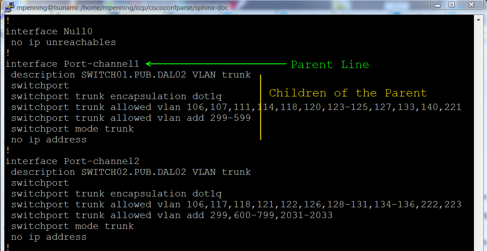

=============
Introduction
=============

Overview
---------

ciscoconfparse is a Python_ library, which parses through Cisco IOS-style 
configurations.  It can:

- Audit existing router / switch / firewall / wlc configurations
- Retrieve portions of the configuration
- Modify existing configurations
- Build new configurations

The library examines an IOS-style config and breaks it into a set of linked 
parent / child relationships; each configuration line is stored in a different 
:class:`~models_cisco.IOSCfgLine` object.

   Figure 1, An Example of Parent-line / Child-line relationships

Then you issue queries against these relationships using a familiar family 
syntax model. Queries can either be in the form of a simple string, or you can 
use `regular expressions`_. The API provides powerful query tools, including 
the ability to find all parents that have or do not have children matching a 
certain criteria.

The package also provides a set of methods to query and manipulate the 
:class:`~models_cisco.IOSCfgLine` objects themselves. This gives you a flexible 
mechanism to build your own custom queries, because the 
:class:`~models_cisco.IOSCfgLine` objects store all the parent / child 
hierarchy in them.

|br|
|br|
|br|
|br|
|br|
|br|
|br|
|br|

What is ciscoconfparse good for?
----------------------------------

After several network evolutions, you may have a tangled mess of conflicting or 
misconfigured Cisco devices.  Misconfigurations of proxy-arp, static routes, 
FHRP timers, routing protocols, duplicated subnets, cdp, console passwords, or 
aaa schemes have a measurable affect on uptime and beg for a tool to audit them.
However, manually scrubbing configurations is a long and error-prone process.

Audits aren't the only use for ciscoconfparse.  Let's suppose you are working 
on a design and need a list of dot1q trunks on a switch with more than 400 
interfaces.  You can't grep for them because you need the interface names of 
layer2 trunks; the interface name is stored on one line, and the trunk 
configuration is stored somewhere below the interface name.  With 
ciscoconfparse, it's really this easy...

.. sourcecode:: python

   >>> from ciscoconfparse import CiscoConfParse
   >>> parse = CiscoConfParse('/tftpboot/largeConfig.conf')
   >>> trunks = parse.find_parents_w_child("^interface", "switchport trunk")
   >>> for intf in trunks:
   ...     print intf
   interface GigabitEthernet 1/7
   interface GigabitEthernet 1/23
   interface GigabitEthernet 1/24
   interface GigabitEthernet 1/30
   interface GigabitEthernet 3/2
   interface GigabitEthernet 5/10
   <and so on...>

So you may be saying, that all sounds great, but I have no idea what you did 
with that code up there.  If so, don't worry... There is a tutorial following 
this intro.  For more depth, I highly recommend `Dive into Python`_ and 
`Dive into Python3`_.

What's new in version 1.0.0
---------------------------

I wrote :mod:`ciscoconfparse` seven years ago as literally my first Python 
project; through the years, my understanding of Python improved, and I also 
found many missing features along the way. Some of these features, like 
changing a configuration after it was parsed, required non-trivial changes to 
the whole project.

Starting in version 0.9, I initiated a major rewrite; several important 
changes were made:

- Python3 compatibility; Python2.4 deprecation
- Major improvement in config parsing speed
- Much better unit-test coverage
- Too many bugfixes to count
- New feature - :mod:`ciscoconfparse` inserts, deletes and appends config lines
- Rearchitected the library, with an eye towards more future improvements
- Revisions in scripting flow.  All users are encouraged to use :class:`~models_cisco.IOSCfgLine()` objects whenever possible.  Typically, you'll start by matching them with :func:`~ciscoconfparse.CiscoConfParse.find_objects()`.  Working directly with :class:`~models_cisco.IOSCfgLine()` objects makes your scripts less complicated and it also makes them faster than using legacy :mod:`ciscoconfparse` syntax.

.. _`Dive into Python`: http://www.diveintopython.net/
.. _`Dive into Python3`: http://www.diveintopython3.net/
.. _`regular expressions`: https://docs.python.org/2/howto/regex.html
.. _Python: http://python.org/

.. |br| raw:: html

    
